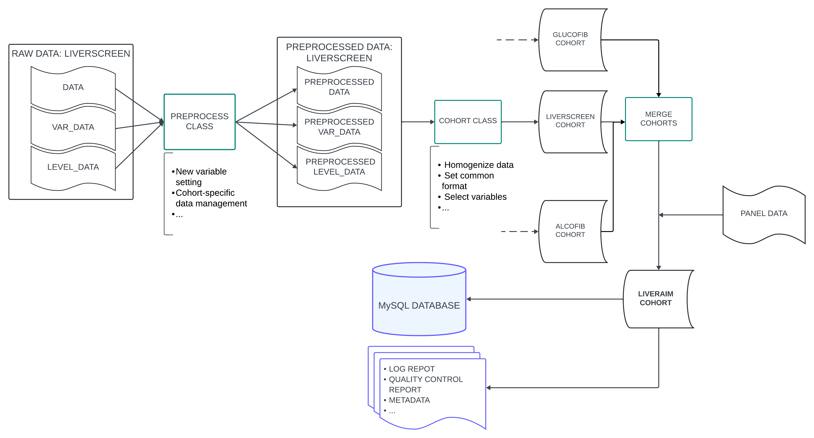

# Overview

hola oscar

## Dataflow

This section describes the data flow and ETL process, from the data reading to data export in various formats.

The data processing follows these steps, which are explained in detail in this document:

+ [**Data Reading**](#data-reading): Reading of all data required for the creation of the data warehouse. Specifically, the files described in [initial_data_configuration](liveraim_data_warehouse_specifications.md#initial-data-and-configuration-data) are read.
+ [**Data Preprocessing**](#data-preprocessing): An initial transformation of the data is performed, where some variables are added and combined. This process allows each cohort to be treated individually and specific changes to be applied to that cohort.
+ [**Cohort Instantiation and Processing**](#cohort-instantiation-and-processing): For each cohort, a `Cohort` object is created. This centralizes the formatting and homogenization of the cohorts to produce a curated database with a consistent format across all cohorts.
+ [**Cohort Quality Control**](#cohort-quality-control): Quality control is performed for each cohort to validate the transformations carried out in the previous steps.
+ [**Cohort Merging**](#cohort-merging): Once the different cohorts with homogenized data have been created, they are merged into a new `Cohort` object (named `liveraim`). Two important actions are performed in this cohort:
    + The variable `liveraim_id` is added, a common format identifier.
    + The different panels (in `DataFrame` format) that will later be exported are created.
+ [**Exportation to Files**](#exportation-to-files): The created panels are exported as `.feather` and `.csv` files for further analysis.
+ [**Exportation to MySQL Database**](#exportation-to-mysql-database): A connection is made to MySQL, where the various tables and relationships of the schema are created, and the data is exported to SQL format.

The following image describes schematically the ETL process:



## Data Reading

Data reading is handled through the [`DataReader`](modules_documentation/file_reading_utils_doc.md) class. This class is responsible for reading the following files for each cohort:

+ **`var_data (.xlsx)`**: A .xlsx file that is loaded into the code as a `DataFrame`.
+ **`level_data (.xlsx)`**: A .xlsx file that is loaded into the code as a `DataFrame`.
+ **`comb_var_data (.json)`**: A .json file that is loaded into the code as a dictionary.
+ **`databases (variable)`**: For each cohort, there will be one or more versions of the database. `DataReader` reads each version in its respective format (`.dta`, `.sav`, ...) and loads them into the code as `pandas` `DataFrames`. These dataframes are stored in a dictionary where the *key* is the version name (i.e., the date when the DB version was received) and the *value* is the DataFrame containing the database.

Additionally, it reads the data related to the final structure of the panels. This is stored in the `panel_metadata (.xlsx)` file. Since this is a .xlsx file with multiple sheets, it is loaded into the code as a dictionary where the *key* is the sheet name (i.e., the name of the panel) and the *value* is a `DataFrame` with the content of the sheet.

These data are stored in the `DataReader.all_data` attribute, a dictionary with the following structure:

```yaml
all_data:
  <cohort_name_1>:                      # Name of the cohort
    data: <database_versions_dictionary>    # Dictionary containing each database version
    var_data: <var_data_file>           # Excel file containing var_data
    level_data: <level_data_file>       # File containing level_data
    comb_var_data: <comb_var_data_file> # File containing comb_var_data
  <cohort_name_2>:                      # Name of the next cohort
    data: <database_versions_dictionary>    # Dictionary containing each database version
    var_data: <var_data_file>           # Excel file containing var_data
    level_data: <level_data_file>       # File containing level_data
    comb_var_data: <comb_var_data_file> # File containing comb_var_data
  ...
  panel_data: <panel_data_file>         # Dictionary with panel_data information  
```

> **Note**: The data warehouse will be created using all versions of the databases, up to the most recent one. This allows for more detailed tracking of patients who have entered and exited in each version. How the different versions are managed is explained in the next section, [Data Preprocessing](#data-preprocessing).

These files are essential for the correct processing of the data. To see the structure of these files, refer to the section [initial_data_configuration](liveraim_data_warehouse_specifications.md#initial-data-and-configuration-data).

The variables that store the filenames to be read, as well as the directories where these files are located, are defined in the module [`main_config`](modules_documentation/configuration_module.md#main_config-module).

Refer to [`data_reading_utils`](modules_documentation/file_reading_utils_doc.md) for more details on the internal workings of `DataReader` and the data reading process.

## Data Preprocessing

Once the initial data is loaded, an instance of the `DataPreprocessor` class is created for each cohort. This instance takes as parameters all the elements from `all_data[cohort_name]`, as well as the name of the respective cohort. This data is stored in the atributes `cohort_databases`, `vara_data`, `level_data`, `var_comb_data` and `cohort_name` respectively. 

`DataPreprocessor` performs the following actions:

+ [Merging database versions](#merging-database-versions) 
+ [Addition of new variables](#addition-of-new-variables)
+ [Combination of variables](#combination-of-variables)

The aim of this class is to prepare the data from each cohort for the formatting and homogenization process, which requires a specific structure. This class is designed to handle each cohort individually and allows for specific adjustments to be made for each cohort, adapting to the particularities of each one.


#### Merging database versions 

The dictionary containing the cohort database versions is stored in the attribute `DataPreprocessor.cohort_databases`. From the dataframes of each version, a **single dataframe** will be generated that contains, for each patient present in at least one of the versions, the latest available data (i.e., the data from the most recent version in which they appear).

Additionally, the variable `status` is added. This categorical variable can take 3 values:

+ `finished`: Patients who appear in the latest version of the cohort database, and the cohort is already closed.
+ `ongoing`: Patients who appear in the latest version of the cohort database, and the cohort is still ongoing.
+ `withdrawn`: Patients who do not appear in the latest version of the cohort database.

The variable `date_version (str)` is also added, indicating the version from which each patient's data is extracted.

> **Note**: During this process, it is required that the variables in the databases (and their names) do not change between versions. Checks are performed to ensure compatibility between versions, and if they are not compatible, only the latest version will be used, and the previous ones will be ignored.

To obtain this **single dataframe**, the following steps are followed:

+ The `date_version` column is assigned to each dataframe from each version. This column will contain the version to which that data corresponds (i.e., all columns in the same dataframe will have the same value).
+ All versions of the database are concatenated (vertically). This requires the structure of the dataframes to be compatible.
+ The rows are sorted according to the `date_version` variable.
+ Rows with duplicate values in the `id_var` column (the patient identifier) are removed, keeping the latest `date_version`.
+ The `status` variable is added by verifying if the `date_version` of each patient corresponds to the latest version.

Since `status` will be one of the core variables in the data warehouse, the `var_data` and `level_data` attributes are updated to include this variable.

this new dataframe is stored in `data` atribute.

#### Addition of new variables

Once a single dataframe with the database is created, the following variables will be added to the `data` attribute:

+ `birth_date`: Obtained by combining the patient's age with the date of entry into the cohort.
+ `exit_date`: Date of exit from the cohort if the patient is not ongoing, or the current date at the time of code execution otherwise.
+ `cohort`: The name of the cohort to which the data belongs.

> **Note**: Just as with the `status` variable, since these new variables will be core variables, the `var_data` attribute will be updated (adding the metadata of the respective variable). In addittion if a categorical variable is added, the `level_data` attribute will also be updated accordingly.

#### Combination of variables

If the `var_comb_data` parameter is passed during the initialization of `DataPreprocessor`, it will be used to combine the variables specified in that parameter. The primary goal here is to reduce the number of missing values by using variables that refer to the same magnitude but have different units.

To achieve this, `DataPreprocessor` utilizes the `VarCombiner` class, which is instantiated with a dataframe (in this case, the `data` attribute) and a dictionary that defines the variable combinations (in this case the `var_comb_dict` attribute). It is recommended to consult the section [`comb_var_data` file](liveraim_data_warehouse_specifications.md#comb_var_data-file) for details on the internal structure of the dictionary. Additionally, refer to the section [`Class VarCombiner`](modules_documentation/data_processing_utils_doc.md#class-varcombiner) for more information on how the class works.

For each variable to be combined, `VarCombiner` sequentially checks whether a variable with a certain magnitude is missing. If it is not missing, the value of that variable is taken as the final value (applying the appropriate conversion factor). If the value is missing, it moves on to the next variable referring to the same magnitude (but with different units) and performs the same check. If all variables in the iteration are missing, `NaN` is assigned as the final value.

To illustrate this, suppose the `var_comb_data` dictionary is as follows:


    {
        "glc": {
            "glc": 1,
            "glc_mg_dl": 0.055
        },
        "crea_mg_dl": {
            "crea_mg_dl": 1,
            "creat": 0.017
        }
    }


This indicates that two variables should be combined: `glc` (using `glc` and `glc_mg_dl`) and `crea_mg_dl` (using `creat` and `crea_mg_dl`). `VarCombiner` will first iterate over the pair `"glc": {"glc": 1, "glc_mg_dl": 0.055}`. The `glc` variable (the first key) will be calculated as described above: if `glc` (in this case, the key in the pair `"glc": 1`) is not missing, this value will be used for the `glc` variable. Otherwise, it will check if `glc_mg_dl` is missing. If it is not missing, the value of `glc_mg_dl` multiplied by 0.055 will be used as the final value (where 0.055 is the conversion factor to convert `glc_mg_dl` units to `glc` units).

The processing for `crea_mg_dl` is entirely analogous.

The final result is that in the `data` attribute, the `glc` and `crea_mg_dl` variables will be populated with values from other *compatible* variables.


## Cohort Instantiation and Processing

Once the cohort data has been preprocessed, it is formatted so that all cohorts have a homogeneous structure and can be subsequently combined. The central element of this processing is the `Cohort` class, and the `var_data` and `level_data` objects mentioned earlier are essential for its correct operation.

For each cohort, a `Cohort` object is instantiated, which uses the (already preprocessed) attributes of `DataPreprocessor`: `data` (as the `raw_data` parameter), `var_data`, and `level_data`. It is important to note that each row in the `var_data` DataFrame corresponds to one of the selected core variables. For each of these variables, this DataFrame contains configuration data about how they should be transformed:

+ Initial variable name in the cohort.
+ Final variable name in the common database.
+ Final variable datatype.
+ Conversion factor (if needed).

Additionally, the cohort name (parameter `cohort_name`), the ID variable name (parameter `id_variable`), the inclusion date variable name (parameter `date_variable`), and the cohort status (parameter `status`) are introduced as parameters. Optionally, a dictionary with the structure of `comb_var_data` can also be provided. For more detailed information about these objects, refer to the section [`initial_data_configuration`](liveraim_data_warehouse_specifications.md#comb_var_data-file).

The instantiation of the cohort concludes with a call to the `Cohort.homogenize_data` method. This method creates a copy of the `raw_data` attribute (which was initialized with the preprocessed cohort database, i.e., the `raw_data` parameter), formats it, and stores it in the `homogeneous_data` attribute. In general terms, the data formatting follows these steps:

1. **Selection** of the subset of `raw_data` with the core variables.
2. **Translation** of the variable names (columns of the DataFrame) to the final names defined in `var_data`.
3. **Formatting** of the variables. It iterates over each of the selected variables and:
    1. Verifies the datatype assigned in `var_data` and applies the appropriate datatype to that column.
    2. If the variable is numeric, applies the appropriate conversion factor.
    3. If the variable is categorical, maps the original levels to the final levels. This mapping is defined in `level_data`.

The result for each cohort should be the same: a DataFrame with the same structure, variables, and format stored in the `homogeneous_data` attribute. The only difference between cohorts would be the number of patients.

For more details on the specific implementation of the `Cohort` class and its methods, refer to the section dedicated to the [cohort_utils](modules_documentation/cohort_utils_doc.md).

## Cohort Quality Control

For more details on the specific implementation of the QC checks, refer to the section  [qc_checks_utils_doc](modules_documentation/qc_checks_utils_doc.md).

## Cohort Merging

Once all cohorts have been formatted, they are merged using the `merge_cohorts` function, defined in the [`cohort_utils`](modules_documentation/cohort_utils_doc.md) module. `merge_cohorts` takes a list of already instantiated cohorts (i.e., they contain the `homogeneous_data` attribute) and performs the following actions:

1. Concatenates (vertically) the `homogeneous_data` attributes (DataFrames) from each cohort, ensuring that the resulting DataFrame combines all the data from the individual cohorts.
2. Merges the `var_data` attributes (DataFrames) from each cohort, ensuring that the resulting DataFrame is consistent with the merged database and that any discrepancies are handled.
3. Merges the `level_data` attributes (DataFrames) from each cohort, ensuring that the resulting DataFrame is consistent with the merged database and that categorical variables are properly aligned across cohorts.
4. Instantiates a new `Cohort` object using the previously created merged elements. This cohort is named `liveraim` from now on. 

For more details on the functionality of this process, refer to the section [`merge_cohorts` function](modules_documentation/cohort_utils_doc.md#merge_cohorts-function).

<span style="color:red">falta indicar que se añade la variable id</span>

## Exportation to Files

If the variable `EXPORT_FILES` defined in the `main_config` module is set to `True`, the data for each of the final panels will be exported as files. In the current version, the data is exported to `.csv` and `.feather` formats.


## Exportation to MySQL Database
After exporting the database as files, the MySQL database is created. The module responsible for handling this export is [`sql_exporting_utils`](modules_documentation/sql_exporting_utils_doc.md). Specifically, the `SQLExporter` class, defined in this module, centralizes the connection to the database, the creation of tables, and the export of data.

The `SQLExporter` class is initialized using the `panel_metadata` DataFrame dictionary (this object has not been modified at any point). This dictionary specifies the structure of each of the final panels in the database. For more information on the structure of the `panel_metadata` file (and the corresponding `panel_metadata` object), see the section [`panel_data` file](liveraim_data_warehouse_specifications.md#panel_data-file).

`SQLExporter` performs the following actions sequentially:

1. **Creates an `engine` object**, which establishes the connection to the database based on the configuration specified in the `connection_config` module. For more information on the connection parameters, see the section [`connection_config` module](modules_documentation/configuration_module.md#connection_config-module).
2. **Creates the database structure**: It defines the tables, the format of each table (which variables each contains, whether it's in long or wide format, etc.), and the relationships between them. To do this, it uses the configuration data  present in the `panel_metadata` object.
3. Establishes the connection to the database and generates the previously defined tables in the MySQL database.
4. Iterates over each of the DataFrames in `liveraim.final_data` and inserts the data into the corresponding table.

> **Note**: The `engine` object does not immediately create the connection, but dynamically manages connections as needed. Therefore, until the tables are explicitly created in the database (and then populated), it does not actually connect to the database. Similarly, step *2* is internal to the `SQLExporter` class, meaning that when the table and relationship structure is created, it is stored in an internal object within the class. It is in step *3* that this structure is executed when an explicit connection to the database is established.
