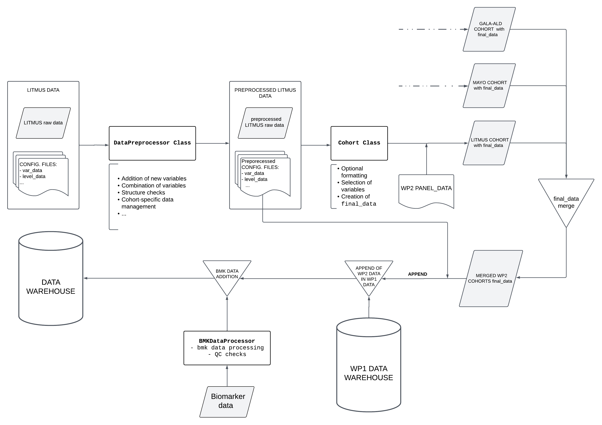

# Overview

## Dataflow

This section describes the data flow and ETL process, from the data reading to data export in various formats.

The data processing follows these steps, which are explained in detail in this document:

+ [**Data Reading**](#data-reading): Reading of all data required for the creation of the data warehouse. Specifically, the files described in [initial_data_configuration](liveraim_data_warehouse_specifications.md#initial-data-and-configuration-data) are read.
+ [**Data Preprocessing**](#data-preprocessing): An initial transformation of the data is performed, where some variables are added and combined. This process allows each cohort to be treated individually and specific changes to be applied to that cohort.
+ [**Cohort Instantiation and Processing**](#cohort-instantiation-and-processing): For each cohort, a `Cohort` object is created. This centralizes the formatting and homogenization of the cohorts to produce a curated database with a consistent format across all cohorts.
+ [**Cohort Quality Control**](#cohort-quality-control): Quality control is performed for each cohort to validate the transformations carried out in the previous steps.
+ [**Cohort Merging**](#cohort-merging): Once the different cohorts with homogenized data have been created, they are merged into a new `Cohort` object (named `liveraim`). Two important actions are performed in this cohort:
    + The variable `liveraim_id` is added, a common format identifier.
    + The different panels (in `DataFrame` format) that will later be exported are created.
+ [**Biomarker data processing**](#biomarker-data-processing): 
+ [**Exportation to Files**](#exportation-to-files): The created panels are exported as `.feather` and `.csv` files for further analysis.
+ [**Exportation to MySQL Database**](#exportation-to-mysql-database): A connection is made to MySQL, where the various tables and relationships of the schema are created, and the data is exported to SQL format.

The following image describes schematically the ETL process:



## Data Reading

Data reading is handled through the [`DataReader`](modules_documentation/file_reading_utils_doc.md) class. This class is responsible for reading the following files for each cohort:

+ **`var_data (.xlsx)`**: A .xlsx file that is loaded into the code as a `DataFrame`.
+ **`level_data (.xlsx)`**: A .xlsx file that is loaded into the code as a `DataFrame`.
+ **`comb_var_data (.json)`**: A .json file that is loaded into the code as a dictionary.
+ **`databases (variable)`**: For each cohort, there will be one or more versions of the database. `DataReader` reads each version in its respective format (`.dta`, `.sav`, ...) and loads them into the code as `pandas` `DataFrames`. These dataframes are stored in a dictionary where the *key* is the version name (i.e., the date when the DB version was received) and the *value* is the DataFrame containing the database.

Additionally, it reads the data related to the final structure of the panels. This is stored in the `panel_metadata (.xlsx)` file. Since this is a .xlsx file with multiple sheets, it is loaded into the code as a dictionary where the *key* is the sheet name (i.e., the name of the panel) and the *value* is a `DataFrame` with the content of the sheet.

These data are stored in the `DataReader.all_data` attribute, a dictionary with the following structure:

```yaml
all_data:
  <cohort_name_1>:                      # Name of the cohort
    data: <database_versions_dictionary>    # Dictionary containing each database version
    var_data: <var_data_file>           # Excel file containing var_data
    level_data: <level_data_file>       # File containing level_data
    comb_var_data: <comb_var_data_file> # File containing comb_var_data
  <cohort_name_2>:                      # Name of the next cohort
    data: <database_versions_dictionary>    # Dictionary containing each database version
    var_data: <var_data_file>           # Excel file containing var_data
    level_data: <level_data_file>       # File containing level_data
    comb_var_data: <comb_var_data_file> # File containing comb_var_data
  ...
  panel_data: <panel_data_file>         # Dictionary with panel_data information  
```

This process is carried out for the data of each WP. In particular, each WP will contain not only the various data related to the cohort databases and configuration files but will also have its own panel configuration document, which may differ from those of other WPs. Therefore, when using the `DataReader` class, one must specify both the list of cohort names to be read and the WP they belong to (currently, only `WP1` and `WP2` can be specified).

> **Note 1**: Currently, only data from the same WP1 can be read at once due to the structure of the code. In future versions, reading all cohorts at once will be possible (probably if no WP is provided).

> **Note 2**: The data warehouse will be created using all versions of the cohort databases, up to the most recent one. This allows for more detailed tracking of patients who have entered and exited in each version. How the different versions are managed is explained in the next section, [Data Preprocessing](#data-preprocessing).

These files described above are essential for the correct processing of the data. To see the structure of these files, refer to the section [initial_data_configuration](liveraim_data_warehouse_specifications.md#initial-data-and-configuration-data).

The variables that store the filenames to be read, as well as the directories where these files are located, are defined in the module [`main_config`](modules_documentation/configuration_module.md#main_config-module).

Refer to [`data_reading_utils`](modules_documentation/file_reading_utils_doc.md) for more details on the internal workings of `DataReader` and the data reading process.

## Data Preprocessing

Once the initial data is loaded, an instance of the `DataPreprocessor` class is created for each cohort. This instance takes as parameters all the elements from `all_data[cohort_name]`, as well as the name of the respective cohort. This data is stored in the atributes `cohort_databases`, `vara_data`, `level_data`, `var_comb_data` and `cohort_name` respectively. 

`DataPreprocessor` performs the following actions:

+ [Creation of `VarData` object](#creation-of-vardata-object)
+ [Merging database versions](#merging-database-versions)
+ [ID transformations](#id-transformations)
+ [Addition of new variables](#addition-of-new-variables)
+ [Combination of variables](#combination-of-variables)
+ [IDs dropping](#ids-dropping)
+ [Cohort-specific transformations](#cohort-specific-transformations)

The aim of this class is to prepare the data from each cohort for the formatting and homogenization process, which requires a specific structure. This class is designed to handle each cohort individually and allows for specific adjustments to be made for each cohort, adapting to the particularities of each one.

#### Creation of `VarData` object

The `VarData` object is responsible for centralizing all the configuration data and metadata of the core variables (both the variables from the original cohort and those calculated during execution). It allows easy access to every variable property and facilitates the merging of different cohorts into one. For further information on the `VarData` object, its configuration, and functionality, please check the section [VarData](modules_documentation/metadata_utils_doc.md/#vardata).

This object is instantiated for each cohort using the data contained in the `var_data` and `level_data` dataframes, as well as the `var_comb_dict` dictionary. Once created, it will be used to perform the proper transformation of the raw data (i.e., the previously mentioned objects `var_data`, `level_data`, and `var_comb_data` will no longer be used).

This object will be stored in the attribute `DataPreprocessor.varData` of the class to be used during data harmonization, quality control, and exportation.


#### Merging database versions 

The dictionary containing the cohort database versions is stored in the attribute `DataPreprocessor.cohort_databases`. From the dataframes of each version, a **single dataframe** will be generated that contains, for each patient present in at least one of the versions, the latest available data (i.e., the data from the most recent version in which they appear).

Additionally, the variable `status` is added. This categorical variable can take 3 values:

+ `finished`: Patients who appear in the latest version of the cohort database, and the cohort is already closed.
+ `ongoing`: Patients who appear in the latest version of the cohort database, and the cohort is still ongoing.
+ `withdrawn`: Patients who do not appear in the latest version of the cohort database.

The variable `date_version (str)` is also added, indicating the version from which each patient's data is extracted.

> **Note**: During this process, it is required that the variables in the databases (and their names) do not change between versions. Checks are performed to ensure compatibility between versions, and if they are not compatible, only the DataFrame form the latest version will be used, and the previous ones will be ignored.

To obtain this **single dataframe**, the following steps are followed:

+ The `date_version` column is assigned to each dataframe from each version. This column will contain the version to which that data corresponds (i.e., all columns in the same dataframe will have the same value).
+ All versions of the database are concatenated (vertically). This requires the structure of the dataframes to be compatible.
+ The rows are sorted according to the `date_version` variable.
+ Rows with duplicate values in the `id_var` column (the patient identifier) are removed, keeping the latest `date_version`.
+ The `status` variable is added by verifying if the `date_version` of each patient corresponds to the latest version.

Since `status` will be one of the core variables in the data warehouse, the `varData` attribute is updated to include this variable.

this new dataframe is stored in `data` attribute.

#### ID transformations

The format of patient identification variables can vary significantly between cohorts (even at the intra-cohort level), and the identifiers from laboratories may present (and do present) certain inconsistencies and errors compared to the cohort identifiers.  
To address this issue, the ID variables of all cohorts are transformed, ensuring that there is a correspondence between the IDs from the cohorts and those from the laboratory data. The following transformations are performed:

- **`Addition of 0's`**: A significant number of IDs contain a hyphen in the middle of the identifier (*e.g.*, `1055-12`). This leads to errors if, for example, the same patient is registered as `1055-0012` in another database. To prevent this, zeros are added after the hyphen to ensure that all identifiers have the same length (after the hyphen). In the current version, this length has been set to 5. Thus, after the transformation, both identifiers would be converted to `1055-00012`.
- **`Deletion of blank spaces`**: All blank spaces in the IDs are removed.
- **`Deletion of typos`**: Some symbols, such as `º, $`, etc., are considered typos and are removed from the ID if present.
- **`Uppercasing`**: All letters in the identifiers are converted to uppercase (if they are not already). Thus, the identifiers such as `glu1234` and `GLU1234` would both be transformed into `GLU1234`.


#### IDs dropping

Some patients must be removed from the database, often because they have duplicate entries for certain values. This may occur, for example, due to errors when entering IDs into the databases. The file `ids_to_drop.txt`, located in the `data` directory (see [Structure of the Project Directory](quick_start_guide.md/#structure-of-the-project-directory)), contains the list of IDs that must be removed from the final DW.  

During the preprocessing of each cohort, the system checks whether the identifiers listed in this file are present in the database, and if so, their entries are deleted.

#### Addition of new variables

Once a single dataframe with the database is created, the following variables are added to the `data` dataframe attribute:

+ `birth_date`: Obtained by combining the patient's age with the date of entry into the cohort.
+ `exit_date`: Date of exit from the cohort if the patient is not ongoing, or the current date at the time of code execution otherwise.
+ `cohort`: The name of the cohort to which the data belongs.
+ `work_package`: The work package which the cohort comes from. 

> **Note**: Just as with the `status` variable, since these new variables will be core variables, the `varData` attribute will be updated accordingly (adding the metadata of the respective variable).

#### Combination of variables

If the `var_comb_data` parameter is passed during the initialization of `DataPreprocessor`, it will be used to combine the variables specified in that parameter. The primary goal here is to reduce the number of missing values by using variables that refer to the same magnitude but have different units.

To achieve this, `DataPreprocessor` utilizes the `VarCombiner` class, which is instantiated with a dataframe (in this case, the `data` attribute) and a dictionary that defines the variable combinations (in this case the `var_comb_dict` attribute). It is recommended to consult the section [`comb_var_data` file](liveraim_data_warehouse_specifications.md#comb_var_data-file) for details on the internal structure of the dictionary. Additionally, refer to the section [`Class VarCombiner`](modules_documentation/data_processing_utils_doc.md#class-varcombiner) for more information on how the class works.

For each variable to be combined, `VarCombiner` sequentially checks whether a variable with a certain magnitude is missing. If it is not missing, the value of that variable is taken as the final value (applying the appropriate conversion factor). If the value is missing, it moves on to the next variable referring to the same magnitude (but with different units) and performs the same check. If all variables in the iteration are missing, `NaN` is assigned as the final value.

To illustrate this, suppose the `var_comb_data` dictionary is as follows:


    {
        "glc": {
            "glc": 1,
            "glc_mg_dl": 0.055
        },
        "crea_mg_dl": {
            "crea_mg_dl": 1,
            "creat": 0.017
        }
    }


This indicates that two variables should be combined: `glc` (using `glc` and `glc_mg_dl`) and `crea_mg_dl` (using `creat` and `crea_mg_dl`). `VarCombiner` will first iterate over the pair `"glc": {"glc": 1, "glc_mg_dl": 0.055}`. The `glc` variable (the first key) will be calculated as described above: if `glc` (in this case, the key in the pair `"glc": 1`) is not missing, this value will be used for the `glc` variable. Otherwise, it will check if `glc_mg_dl` is missing. If it is not missing, the value of `glc_mg_dl` multiplied by 0.055 will be used as the final value (where 0.055 is the conversion factor to convert `glc_mg_dl` units to `glc` units).

The processing for `crea_mg_dl` is entirely analogous.

The final result is that in the `data` attribute, the `glc` and `crea_mg_dl` variables will be populated with values from other *compatible* variables.

#### **Cohort-specific transformations**

The following section describes the specific modifications applied to each cohort:

##### **Liverscreen**

*Temporary*: Currently, one of the database versions (`20241223`) includes the `Ever smoker` level in the `smoke` variable, which was not present in previous versions. This level is encoded with the value `1.5`. These values are mapped to the string `"Ever smoker"`, a notation that is more consistent with the rest of the versions.  

##### **Decide**

Some patients in the Decide cohort are also present in the Liverscreen cohort (those whose ID starts with `1056`). These patients are removed from the cohort to avoid duplicates.
 
##### **Alcofib**

Some heterogeneity in variables with percentage units can be found at the cohort level. This means that, for the same variable (with percentage units), some values are given as actual `%`, while others appear to be given per unit (i.e., as a proportion). To address this issue, the `harmonize_percent` function is called, which transforms all the values into percentages. 

To achieve this, the function multiplies by 100 all the values below a certain threshold (currently set to 1), assuming that any value lower than 1 is given as a proportion rather than a percentage.

> **Warning**: This "two units" situation is inferred from the nature of the data and the variables. This means that there has been no strict confirmation of this issue yet. However, as it is the best explanation for the inconsistency, the transformation is applied. Ideally, this should be verified with the individuals responsible for the cohorts where these transformations are performed.

##### **Glucofib**

Similarly to the Alcofib cohort, some heterogeneity in variables with percentage units can be found at the cohort level. This means that, for the same variable (with percentage units), some values are given as actual `%`, while others appear to be given per unit (i.e., as a proportion). To address this issue, the `harmonize_percent` function is called, which transforms all the values into percentages. 

To achieve this, the function multiplies by 100 all the values below a certain threshold (currently set to 1), assuming that any value lower than 1 is given as a proportion rather than a percentage.

> **Warning**: This "two units" situation is inferred from the nature of the data and the variables. This means that there has been no strict confirmation of this issue yet. However, as it is the best explanation for the inconsistency, the transformation is applied. Ideally, this should be verified with the individuals responsible for the cohorts where these transformations are performed.

##### **Marina1**

No transformations specific to this cohort are currently performed.

##### **Metronord**

No transformations specific to this cohort are currently performed.

##### **Gala-ald**

No transformations specific to this cohort are currently performed.

## Cohort Instantiation and Processing

Once the cohort data has been preprocessed, it is formatted so that all cohorts have a homogeneous structure and can be subsequently combined. The central element of this processing is the `Cohort` class, and the `VarData` object mentioned earlier is essential for its correct operation.

For each cohort, a `Cohort` object is instantiated, which uses the (already preprocessed) attributes of `DataPreprocessor`: `data` (as the `raw_data` parameter), and `VarData`. It is important to note that the `VarData` object contains a dictionary of `Var` objects (for further information, check the section [Var](modules_documentation/metadata_utils_doc.md#var)). Each of these `Var` objects contains data from a particular variable that will be used during the harmonization process. It contains the following information (it is not an exhaustive list):

+ Initial variable name in the cohort.
+ Final variable name in the common database.
+ Final variable datatype.
+ Conversion factor (if needed).
+ mapping dictionary for categorical variables
+ ...

Additionally, the cohort name (parameter `cohort_name`), the ID variable name (parameter `id_variable`), the inclusion date variable name (parameter `date_variable`), and the cohort status (parameter `status`) are introduced as parameters. Optionally, a dictionary with the structure of `comb_var_data` can also be provided. For more detailed information about these objects, refer to the section [`initial_data_configuration`](liveraim_data_warehouse_specifications.md#comb_var_data-file).

The instantiation of the cohort concludes with a call to the `Cohort.homogenize_data` method. This method creates a copy of the `raw_data` attribute (which was initialized with the preprocessed cohort database, i.e., the `raw_data` parameter), formats it, and stores it in the `homogeneous_data` attribute. In general terms, the data formatting follows these steps:

1. **Selection** of the subset of `raw_data` with the core variables.
2. **Translation** of the variable names (columns of the DataFrame) to the final names defined in `VarData`.
3. **Formatting** of the variables. It iterates over the `VarData` for each of the selected variables and:
    1. Verifies the datatype assigned in `Var` and applies the appropriate datatype to that column.
    2. If the variable is numeric, applies the appropriate conversion factor.
    3. If the variable is categorical, maps the original levels to the final levels. This mapping is defined in the attribute `Var.var_map`.

The result for each cohort should be the same: a DataFrame with the same structure and format stored in the `homogeneous_data` attribute. Currently, the structure of the database allows cohorts with different variables each.

For more details on the specific implementation of the `Cohort` class and its methods, refer to the section dedicated to the [cohort_utils](modules_documentation/cohort_utils_doc.md).

## Cohort Quality Control

After the creation and harmonization of each `cohort` object, a quality control check is performed and stored in an instance of `QCchecker` object. For more details on the specific implementation of the QC checks, refer to the section  [qc_checks_utils_doc](modules_documentation/qc_checks_utils_doc.md).

## Cohort Merging

Once all cohorts have been formatted, they are merged using the `merge_cohorts` function, defined in the [`cohort_utils`](modules_documentation/cohort_utils_doc.md) module. `merge_cohorts` takes a list of already instantiated cohorts (i.e., they contain the `homogeneous_data` attribute) and performs the following actions:

1. Concatenates (vertically) the `homogeneous_data` attributes (DataFrames) from each cohort, ensuring that the resulting DataFrame combines all the data from the individual cohorts.
2. Instantiates a ConfigDataManager object, which allows to merge properly all the `VarData` objects from each cohort.
3. Instantiates a new `Cohort` object using the previously created merged elements. This cohort is named `liveraim` from now on.

Once the new `cohort` object is created, the `set_id` method is called. This method generates a new column in the `homogeneous_data` dataframe attribute, populated with a unified ID for each patient. The structure of this new ID follows the format `LAxxxxx`, where `xxxxx` is a sequential number starting from 1 and increasing up to the total number of rows in the dataframe (i.e., the position of the last patient in the dataframe). The IDs are assigned in ascending order throughout the dataframe.

As a result, the correspondence between the original ID (referred to here as `cohort_id`) and the unified ID (referred to here as `liveraim_id`) may vary depending on the position of each patient’s data within the `homogeneous_data` dataframe. This implies that the mapping between `cohort_id` and `liveraim_id` can change between executions.

For more details on the functionality of this process, refer to the section [`merge_cohorts` function](modules_documentation/cohort_utils_doc.md#merge_cohorts-function).

## Biomarker data processing

## Exportation to Files

If the variable `EXPORT_FILES` defined in the `main_config` module is set to `True`, the data for each of the final panels will be exported as files. In the current version, the data is exported to `.csv` and `.feather` formats.


## Exportation to MySQL Database
After exporting the database as files, the MySQL database is created. The module responsible for handling this export is [`sql_exporting_utils`](modules_documentation/sql_exporting_utils_doc.md). Specifically, the `SQLExporter` class, defined in this module, centralizes the connection to the database, the creation of tables, and the export of data.

The `SQLExporter` class is initialized using the `panel_metadata` DataFrame dictionary (this object has not been modified at any point). This dictionary specifies the structure of each of the final panels in the database. For more information on the structure of the `panel_metadata` file (and the corresponding `panel_metadata` object), see the section [`panel_data` file](liveraim_data_warehouse_specifications.md#panel_data-file).

`SQLExporter` performs the following actions sequentially:

1. **Creates an `engine` object**, which establishes the connection to the database based on the configuration specified in the `connection_config` module. For more information on the connection parameters, see the section [`connection_config` module](modules_documentation/configuration_module.md#connection_config-module).
2. **Creates the database structure**: It defines the tables, the format of each table (which variables each contains, whether it's in long or wide format, etc.), and the relationships between them. To do this, it uses the configuration data  present in the `panel_metadata` object.
3. Establishes the connection to the database and generates the previously defined tables in the MySQL database.
4. Iterates over each of the DataFrames in `liveraim.final_data` and inserts the data into the corresponding table.

> **Note**: The `engine` object does not immediately create the connection, but dynamically manages connections as needed. Therefore, until the tables are explicitly created in the database (and then populated), it does not actually connect to the database. Similarly, step *2* is internal to the `SQLExporter` class, meaning that when the table and relationship structure is created, it is stored in an internal object within the class. It is in step *3* that this structure is executed when an explicit connection to the database is established.
