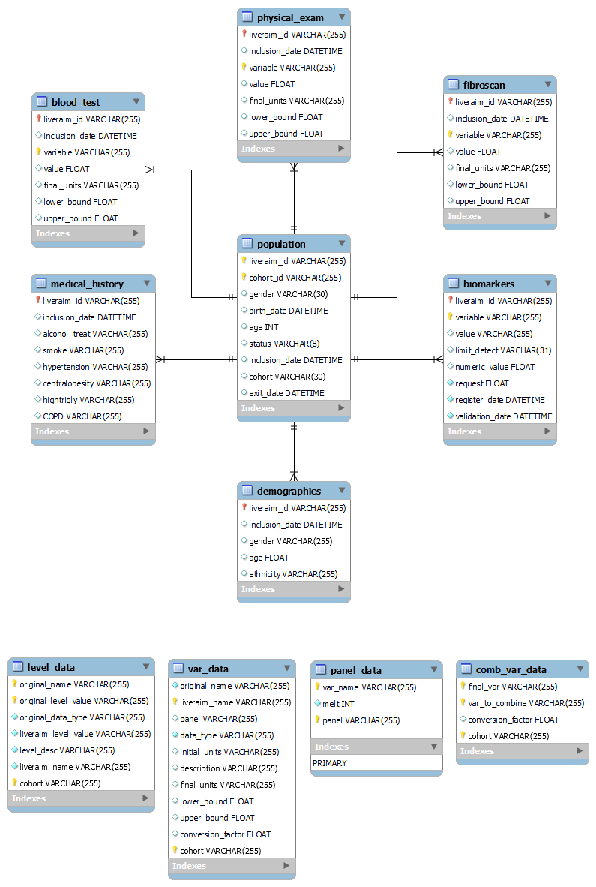

# Overview

This section describes the structure, tables, and relationships within the data warehouse.

The data warehouse is composed of several tables that can be divided into two groups: the database itself, which we will simply call `database`, and the `configuration data` tables, where information about the variables, the structure of the database, mapping dictionaries, etc., is stored. The database, in its first version (prior to receiving biomarker data), consists of the following tables:

- `population`: Contains basic information about each patient, such as gender, status, cohort membership, etc.
- `blood_test_categorical`: Contains categorical variables extracted from the blood test (at `dat_0`).
- `blood_test_numerical`: Contains numerical variables extracted from the blood test (at `dat_0`).
- `demographics`: Contains demographic information about the patient, such as gender, ethnicity, etc.
- `fibroscan`: Contains information related to the fibroscan test results for each patient.
- `physical_exam`: Contains information obtained from the physical examination, including variables such as weight, height, etc.
- `medical_history`: Contains information about each patient's medical history, including relevant comorbidities, etc.

We will refer to these tables as panels or tables interchangeably. The `population` panel acts as the core of the database: the other panels are linked to this primary one (see [General Relationships in the Schema](#general-relationships-in-the-schema)).
 The following image schematically depicts the structure and relationships of the data warehouse:



The data warehouse contains two types of tables in terms of format: **long** format tables and **wide** format tables:

- **Wide**: These are the "usual" tables. Each variable is stored as a separate column in the table. Each row corresponds to the information of a single patient. In these tables, there cannot be duplicates in the identifier columns: all information for a patient is stored in a single row.

- **Long**: These tables contain at least one patient identifier column (in this case, `liveraim_id` and `cohort_id`) along with the `variable` and `value` columns. The `variable` column contains the names of the variables, while the `value` column contains the value of the variable specified in the `variable` column. Tables in long format will have repeated entries in the patient identifier columns. In addition to the columns mentioned, these tables may include other columns that provide additional context for each entry: annotations for variable values (`lower_bound`, `upper_bound`), the date of each observation (`date_0`), and the units of the variable (`final_units`).
Transforming a wide table into a long table is a straightforward process (if the necessary data is available) and is referred to in this documentation as `melting`. Similarly, it is possible to transform a **long** format table into a **wide** format table with the same ease. An example of this format is shown below:

    | date_0              | liveraim_id | cohort_id | variable | value | final_units | lower_bound | upper_bound |
    | ------------------- | ----------- | --------- | -------- | ----- | ----------- | ----------- | ----------- |
    | 2023-01-19 00:00:00 | LA---       | -----     | alb      | NaN   | g/L         |             |             |
    | 2023-01-19 00:00:00 | LA---       | -----     | alk      | 41    | U/L         |             |             |
    | 2023-01-19 00:00:00 | LA---       | -----     | alt      | 21    | UI/L        |             |             |
    | 2023-01-19 00:00:00 | LA---       | -----     | ast      | 20    | U/L         |             |             |
    | 2023-01-19 00:00:00 | LA---       | -----     | bili     | 0.6   | mg/dL       |             |             |
    | 2023-01-19 00:00:00 | LA---       | -----     | cb       | NaN   | mg/dL       |             |             |
    | 2023-01-19 00:00:00 | LA---       | -----     | chol     | 236   | mg/dL       |             |             |
    | 2023-01-19 00:00:00 | LA---       | -----     | crea     | 1.1   | mg/dL       | 0           | 10          |
    | 2023-01-19 00:00:00 | LA---       | -----     | crp      | NaN   | mg/dL       |             |             |
    | 2023-01-19 00:00:00 | LA---       | -----     | ferritin | 146   | ng/mL       |             |             |
    | ...                 |


For `long` tables, since there can (and should) be repetitions in the ID columns (one repetition for each variable in long format at least), composite primary keys are used. In general, this database uses the columns `liveraim_id`, `cohort_id`, and `variable` as composite primary keys: the database does not allow any repetitions of the combination of these three variables.

> **Note**: Using both `liveraim_id` and `cohort_id` within the composite keys is redundant, as there is a bijective correspondence between these two identifiers. However, it has been configured this way to maintain identifier consistency.

It is important to clarify the difference between `cohort_id` and `liveraim_id`. `cohort_id` is the patient-specific identifier within each cohort. The encoding of these identifiers is heterogeneous, varies between cohorts, and originates from the original data. `liveraim_id` is a new variable generated during the execution of `main.py`, which assigns a unique identifier to each patient across all cohorts at the data warehouse level, following a common format. There is a bijective correspondence between these two variables.

> **Note**: The variables in the `variable` column (the "melted" variables) of each `long` table must be of the same data type. This is because SQL does not allow values with different data types in the same column. This adds robustness to the database at the cost of having to create additional tables. For example, in the case of blood test data, two tables are needed: `blood_test_numerical` and `blood_test_categorical`.

# Initial data and configuration data 

This section describes the initial data recieved from the partners and teh configuration files that the program needs to build the database. For each cohort, there are four types of files, which are described below:

* [`database`](#database-files): contains the raw data of the cohort
* [`var_data`](#var_data-files): contains configuration data about the core variables needed to create the data warehouse
* [`level_data`](#level_data-files): contains configuration data about the levels of categorical core variables needed to create the data warehouse
* [`comb_var_data`](#comb_var_data-file): For the variables that need to be combined, it contains the necessary data to perform this process.

Finally, an other file, [`panel_data`](#panel_data-file) is needed for the proper creation of the data warehouse. In this file the structure of the final panels is described. 

## `Database` files

The files we refer to as *database* files contain the raw database of the cohort. These are the files that the partners responsible for each cohort have sent us with the patient data.

The content of these files is never modified, neither manually nor through the code: all data processing is done after reading these files, which remain intact after each execution. The only modification they receive is a renaming necessary for their correct reading. For more details, see the section [Structure of `data/cohort_name/databases/` directory](quick_start_guide.md#structure-of-datacohort_namedatabases-directory).

The format of these files varies depending on the cohort. For more information on reading the data, see the section [File reading utils](modules_documentation/file_reading_utils_doc.md). When this files are read, they are loaded into the code as `pandas.DataFrame` objects. 

> **Note**: For obvious data privacy reasons, these files are not uploaded to GitHub.

## `var_data` files

This file, along with level_data, is essential for the creation of the data warehouse. It is an Excel file (.xlsx) where each row corresponds to one of the selected/core variables. It contains the following columns:

* `original_name (str)`: Name of the core variable in the original database. It varies between cohorts.
* `liveraim_name (str)`: Name of the core variable in the common format, i.e., in the liveraim format.
* `panel (str)`: Panel where the variable will be stored.
* `data_type (str)`: Final datatype of the variable.
* `initial_units (str)`: Units of the variable in the original cohort.
* `description (str)`: Short text describing the variable.
* `final_units (str)`: Final units of the variable, i.e., units in the liveraim data warehouse.
* `lower_bound (float)`: Lower bound of the variable. For checking purposes.
* `upper_bound (float)`: Upper bound of the variable. For checking purposes.
* `conversion_factor (float)`: Conversion factor from initial_units to final_units. Set to 1 if not needed.

Before running the code, you must verify that these files are in the correct directories, can be read correctly, have the structure defined above, and that the information they contain is correct. Any variation in structure/content may result in an error in execution or the creation of an erroneous data warehouse. The correct functioning of the program is highly dependent on these files.

These files are tracked in GitHub like the rest of the scripts, so there is no need to create them from scratch, and they should work fine if the repository is cloned. 

When this file is read, it is loaded into the code as a `pandas.DataFrame` object. Throughout all the documentation, we will refer to this DataFrame also as `var_data`.

> **Note 1**: There must be certain coherence between the var_data files from each cohort: the number of variables in each file (i.e., the number of rows) should be the same. In addition, the set of variables in `liveraim_name` should be the same between cohorts, and the `final_data` column should be consistent. Although this is checked in the code, making sure that there are no errors is recomended. 

> **Note 2**: If needed, addition of other columns is possible and should not create incompatibilities (but the management of those new columns should be implemented).

## `level_data` files

This file, along with `var_data`, is essential for the creation of the data warehouse. These files describe the different levels of the categorical core variables. In this case, each row does not correspond to a variable, but to a level of the original variable. The file contains the following columns:

* `original_name (str)`: Name of the core variable in the original database. It varies between cohorts.
* `original_level_value (Variable)`: Original value of the level in the cohort.
* `original_data_type (str)`: Original datatype of the variable.
* `liveraim_level_value (Variable)`: Value of the level in the final database (i.e., in the LIVERAIM data warehouse).
* `level_desc (str)`: Description/label of the level.
* `liveraim_name (str)`: Name of the core variable in the common format, i.e., in the liveraim format.

Before running the code, you must verify that these files are in the correct directories, can be read correctly, have the structure defined above, and that the information they contain is correct. Any variation in structure/content may result in an error in execution or the creation of an erroneous data warehouse. The correct functioning of the program is highly dependent on these files.

These files are tracked in GitHub like the rest of the scripts, so there is no need to create them from scratch, and they should work fine if the repository is cloned.

When this file is read, it is loaded into the code as a `pandas.DataFrame` object. Throughout all the documentation, we will refer to this DataFrame also as `level_data`.

> **Note**: There must be certain coherence between the `level_data` files from each cohort: In this case, the number of rows in each file does not need to match, as in some cohorts two or more different levels might coincide in the same final level. However, the `original_name`, `liveraim_name`, and `liveraim_level_value` columns should be consistent between files. Although this is checked in the code, it is recommended to ensure there are no errors.

## `comb_var_data` file

This is a `json` file that will be loaded into the code as a dictionary. It contains the necessary information to obtain a final variable by combining original variables present in the database. For more information about this process, see the section [`data_processing_utils`](modules_documentation/data_processing_utils_doc.md), subsection [`class VarCombiner`](modules_documentation/data_processing_utils_doc.md#class-varcombiner). This section describes the class responsible for combining the variables listed in `comb_var_data` according to the specified configuration.

The primary goal of this dictionary is to combine variables that refer to the same magnitude but use different units. Combining these variables helps reduce the number of missing values. For example, in the LIVERSCREEN cohort, for the magnitude blood glucose (in visit 1), there are the variables `glc` (expressed in mmol/L) and `glc_mg_dl` (expressed in mg/dL). Both will be combined to fill missing at least one of the variables have a proper value.

> **Note**: Currently, only the functionality described above has been implemented. However, it can be extended (by modifying this dictionary and the `VarCombiner` class) to combine categorical variables, generate secondary or calculated variables, and more.

The structure of the `comb_var_data` dictionary is as follows:

- **Primary Key**: The name of the final variable resulting from the combination. This variable must appear in the [`var_data`](#var_data-files) file described in this documentation. It usually matches the name of one of the variables to be used in the combination.
- **Primary Value**: A dictionary with the following structure:
    - **Secondary Key**: Names of the variables (in the database) that will be used for the combination.
    - **Secondary Value**: Conversion factor to transform the variable from its original units to the final units (i.e., the units of the variable named by the primary key).

The structure of the dictionary would be:

```yaml
comb_var_data:
  <final_variable_name_1>:            # Primary Key: Name of the final variable
    <original_variable_name_1>: <conversion_factor_1>    # Secondary Key-Value: Original variable and its conversion factor
    <original_variable_name_2>: <conversion_factor_2>    # Secondary Key-Value: Original variable and its conversion factor
  <final_variable_name_2>:            # Primary Key: Name of another final variable
    <original_variable_name_3>: <conversion_factor_3>    # Secondary Key-Value: Original variable and its conversion factor
    <original_variable_name_4>: <conversion_factor_4>    # Secondary Key-Value: Original variable and its conversion factor
  ...
```

And an example: 

    {
        "glc": {
            "glc": 1,
            "glc_mg_dl": 0.055
        },
        "crea_mg_dl": {
            "creat": 0.017,
            "crea_mg_dl": 1
        }
    }

In this case, it indicates that the `glc` variable will be created by combining the `glc` itself and `glc_mg_dl` variables. Specifically, the value of `glc` will be used if it exists, and if not, the value of `glc_mg_dl` will be used, multiplied by the corresponding conversion factor (in this case, 0.055). A similar procedure will be aplied to `crea_mg_dl`.

These files are tracked in GitHub like the rest of the scripts, so there is no need to create them from scratch, and they should work fine if the repository is cloned.

## panel_data file

This file is not specific to any cohort and is used as a guide to create and structure the different final panels. The file `panel_metadata.xlsx` is an Excel file that contains a sheet for each final panel. Each of these panels includes the following columns:

* `var_name (str)`: Name of the variable (in the common liveraim format).
* `melt (int)`: Integer (acting as a boolean, so it is 0 or 1) indicating:

    * `0`: The variable is not melted: it will appear in the panel as a column.
    * `1`: The variable is melted: the variable name and value will be restructured in a long format. A column `variable` will contain the name of the variable, and the column `value` will contain its value.

These files are tracked in GitHub like the rest of the scripts, so there is no need to create them from scratch, and they should work fine if the repository is cloned.

When this file is read, since it is an .xlsx file with multiple sheets, it is loaded into the code as a dictionary of `pandas.DataFrames`. Each sheet name becomes a key, and the corresponding table becomes its value (a `DataFrame`). Throughout the documentation, we will refer to this dictionary as `panel_metadata`.

It is important to maintain the structure of this file (and the previously described). Changes can be easily made to modify the final structure of the data warehouse by adding new sheets to the file (i.e., adding new panels), adding variables to a panel, or changing their structure (long or wide format).

For more information about the structure of the final data, check the next section [LIVERAIM DATA WAREHOUSE STRUCTURE](#liveraim-data-warehouse-structure).


# Liveraim Data Warehouse Structure

The **LIVERAIM DATA WAREHOUSE v0.1** is composed by the following tables:

a. **Database**

  - `population`
  - `blood_test_categorical`
  - `blood_test_numerical`
  - `demographics`
  - `fibroscan`
  - `physical_exam`
  - `medical_history`

b. **Configuration Data**

  - `panel_metadata`
  - `var_data`
  - `level_data`
  - `comb_var_data`
  - `dictionaries`

## a. Database Tables Description

### Table sources:
For each cohort, there is at least one raw database containing patient data. Each database corresponds to a single file, and for some cohorts, different versions of the same database are available. If multiple versions are available, the data from the latest version for each patient will be used. During the data processing phase, the databases are merged into a single table, which is later split and restructured into the various tables of the final database.

From each raw database, a subset of variables is selected. These variables must be common across all cohort databases (although the variable names may differ), ensuring that patient data from different cohorts can be merged. Thus, all variables that appear in the final database are either secondary variables created during the code execution, or they originate from one of the four cohorts (depending on the patient's source) used to construct the final database. For more information about the dataflow go to [dataflow](dataflow.md) section.

A summary of the data sources is presented below:

| **Cohort**  | **Number of versions used** | **File type**       | **Reading method**    |
| ----------- | --------------------------- | ------------------- | --------------------- |
| liverscreen | 7                           | stata file (`.dta`) | `pd.read_stata`       |
| alcofib     | 2                           | sav file (`.sav`)   | `pyreadstat.read_sav` |
| glucofib    | 1                           | csv (`.csv`)        | `pd.read_csv`         |
| decide      | 1                           | stata file (`.dta`) | `pd.read_stata`       |
| galaald     | 1                           | stata file (`.dta`) | `pd.read_stata`       |
| marina      | 2                           | sav file (`.sav`)   | `pyreadstat.read_sav` |

> **Note 1**: Some of the information below may be redundant, as certain variables appear in many or all panels. However, redundancies have been intentionally kept for the sake of clarity and readability.

> **Note 2**: As three of the four used cohorts have been previously managed isnod RedCap, many RedCap names in the final database have been kept as standard (sometimes with few changes). 

### Table: `population`
- **Description:** Defines the population of patients within different cohorts.
- **Fields:**
    - `liveraim_id` (VARCHAR(255)): Common liveraim identifier for the patient. Unique within the data warehouse. 
    - `cohort_id` (VARCHAR(255)): Cohort-specific identifier for each patient in a cohort. Unique within the cohort. 
    - `gender` (VARCHAR(8)): Gender of the patient.
    - `birth_date` (DATETIME): Date of birth of the patient.
    - `status` (VARCHAR(8)): Current status of the patient (ongoing,, withdrawn, finished).
    - `date_0` (DATETIME): Date of patient inclusion in the cohort.
    - `exit_date` (DATETIME): Date of study exit.
- **Format**: wide
- **Primary Key:** (`liveraim_id`, `cohort_id`)
- **Relations:** Central table that relates to all other tables using `liveraim_id` and `cohort_id`.

#### Actions and specification tables

| **Liveraim name** | **Liverscreen name** | **Alcofib name**        | **Glucofib name** | **Decide name** | **SQL data type** | **data type** | **Rule/Notes**                                                                                                                                                                                                                                                                     |
| ----------------- | -------------------- | ----------------------- | ----------------- | --------------- | ----------------- | ------------- | ---------------------------------------------------------------------------------------------------------------------------------------------------------------------------------------------------------------------------------------------------------------------------------- |
| liveraim_id       | -                    | -                       | -                 | -               | VARCHAR(255)      | str           | Created dynamically after merging cohorts.                                                                                                                                                                                                                                         |
| cohort_id         | id                   | Codigo_deidentificacion | id                | id              | VARCHAR(255)      | str           |                                                                                                                                                                                                                                                                                    |
| gender            | gender               | Sexe                    | gender            | gender          | FLOAT             | category      | Applied a mapping (to homogenize level codification) defined in `level_data`.                                                                                                                                                                                                      |
| birth_date        | -                    | -                       | -                 | -               | DATETIME          | datetime      | Variable calculated from patient's age and date_0 (inclusion date).                                                                                                                                                                                                                |
| date_0            | date_0               | Fecha_V1                | date_0            | date_0          | DATETIME          | datetime      |                                                                                                                                                                                                                                                                                    |
| status            | -                    | -                       | -                 | -               | VARCHAR(8)        | category      | Calculated variable. If cohort recruitment is ongoing, it is set to *ongoing*. If cohort recruitment is finished, it is set to *finished*. If the patient has left the cohort (in cases where more than one version is available), it is set to *withdrawn*.                       |
| exit_date         | -                    | -                       | -                 | -               | DATETIME          | datetime      | Calculated variable. If the patient's status is ongoing, it is set to the current date (execution date). If the status is finished, it is set to the date of the last version. If the status is withdrawn, it is set to the date of the last version in which the patient appears. |

### Table: `physical_exam`
- **Description:** Stores physical exam results.
- **Fields:**
    - `liveraim_id` (VARCHAR(255)): Common liveraim identifier for the patient. Unique within the data warehouse. 
    - `cohort_id` (VARCHAR(255)): Cohort-specific identifier for each patient in a cohort. Unique within the cohort. 
    - `date_0` (DATETIME): Date of patient inclusion in the cohort.
    - `variable` (VARCHAR(255)): Name of the variable to which the corresponding value in the `value` column refers.
    - `value` (FLOAT): Value of variable in `variable` column. 
    - `final_units` (VARCHAR(255)): Final units of the value.
    - `lower_bound` (FLOAT): Lower acceptable limit for the value.
    - `upper_bound` (FLOAT): Upper acceptable limit for the value.
- **Format**: Long.
- **Variables in `varible` column**: `weight`, `height`, `bmi`, `hip`.
 
- **Primary Key:** (`liveraim_id`, `cohort_id`, `variable`)
- **Relations:** Relates to the `population` table via `liveraim_id` and `cohort_id`.

#### Actions and specification tables

| **Liveraim name** | **Liverscreen name** | **Alcofib name**        | **Glucofib name** | **Decide name** | **Data type** | **Rule/Notes**                                                       |
| ----------------- | -------------------- | ----------------------- | ----------------- | --------------- | ------------- | -------------------------------------------------------------------- |
| liveraim_id       | -                    | -                       | -                 | -               | VARCHAR(255)  | Created dynamically after merging cohorts.                           |
| cohort_id         | id                   | Codigo_deidentificacion | id                | id              | VARCHAR(255)  |                                                                      |
| date_0            | date_0               | Fecha_V1                | date_0            | date_0          | DATETIME      |                                                                      |
| variable          | -                    | -                       | -                 | -               | VARCHAR(255)  | Obtained from melting the variables `weight`, `height`, `bmi`, `hip` |
| value             | -                    | -                       | -                 | -               | FLOAT         | Obtained from melting the variables `weight`, `height`, `bmi`, `hip` |
| final_units       | -                    | -                       | -                 | -               | VARCHAR(255)  |                                                                      |
| lower_bound       | -                    | -                       | -                 | -               | FLOAT         |                                                                      |
| upper_bound       | -                    | -                       | -                 | -               | FLOAT         |                                                                      |

##### Melted variables metadata

| **Liveraim name** | **Liverscreen name** | **Alcofib name** | **Glucofib name** | **Decide name** | **Data type** | **Rule/Notes**                                    |
| ----------------- | -------------------- | ---------------- | ----------------- | --------------- | ------------- | ------------------------------------------------- |
| weight            | weight               | Peso_V1          | weight            | weight          | float         | Data type modification<br>Apply conversion factor |
| height            | height               | Talla_V1         | height            | height          | float         | Data type modification<br>Apply conversion factor |
| bmi               | bmi                  | BMI_V1           | bmi               | bmi             | float         | Data type modification<br>Apply conversion factor |
| hip               | hip                  | diametro_cintura | hip               | hip             | float         | Data type modification<br>Apply conversion factor |

### Table: `demographics`
- **Description:** Contains demographic information of patients.
- **Fields:**
    - `liveraim_id` (VARCHAR(255)): Common liveraim identifier for the patient. Unique within the data warehouse. 
    - `cohort_id` (VARCHAR(255)): Cohort-specific identifier for each patient in a cohort. Unique within the cohort. 
    - `age` (FLOAT): Age of the patient.
    - `ethnicity` (VARCHAR(255)): Ethnicity of the patient.
    - `gender` (VARCHAR(255)): Gender of the patient.
    - `date_0` (DATETIME): Date of patient inclusion in the cohort.

- **Format**: wide.
- **Primary Key:** (`liveraim_id`, `cohort_id`)
- **Relations:** Relates to the `population` table via `liveraim_id` and `cohort_id`.


#### Actions and specification tables

| **Liveraim name** | **Liverscreen name** | **Alcofib name**        | **Glucofib name** | **Decide name** | **SQL data type** | **data type** | **Rule/Notes**                                                               |
| ----------------- | -------------------- | ----------------------- | ----------------- | --------------- | ----------------- | ------------- | ---------------------------------------------------------------------------- |
| liveraim_id       | -                    | -                       | -                 | -               | VARCHAR(255)      | str           | Created dynamically after merging cohorts.                                   |
| cohort_id         | id                   | Codigo_deidentificacion | id                | id              | VARCHAR(255)      | str           |                                                                              |
| date_0            | date_0               | Fecha_V1                | date_0            | date_0          | DATETIME          | datetime      |                                                                              |
| ethnicity         | ethnicity            | Etnia                   | ethnicity         | ethnicity       | VARCHAR(255)      | category      | Applied a mapping (to homogenize level codification) defined in `level_data` |
| gender            | gender               | Sexe                    | gender            | gender          | VARCHAR(255)      | category      | Applied a mapping (to homogenize level codification) defined in `level_data` |

### Table: `fibroscan`
- **Description:** Records fibroscan exam results.
- **Fields:**
    - `liveraim_id` (VARCHAR(255)): Common liveraim identifier for the patient. Unique within the data warehouse. 
    - `cohort_id` (VARCHAR(255)): Cohort-specific identifier for each patient in a cohort. Unique within the cohort. 
    - `date_0` (DATETIME): Date of patient inclusion in the cohort.
    - `variable` (VARCHAR(255)): Name of the variable to which the corresponding value in the `value` column refers.
    - `value` (FLOAT): Value of variable in `variable` column. 
    - `final_units` (VARCHAR(255)): Final units of the value.
    - `lower_bound` (FLOAT): Lower acceptable limit for the value.
    - `upper_bound` (FLOAT): Upper acceptable limit for the value.
- **Format**: long
- **Variables in `varible` column**: `te`, `cap`.
- **Primary Key:** (`liveraim_id`, `cohort_id`, `variable`)
- **Relations:** Relates to the `population` table via `liveraim_id` and `cohort_id`.

#### Actions and specification tables

| **Liveraim name** | **Liverscreen name** | **Alcofib name**        | **Glucofib name** | **Decide name** | **Data type** | **Rule/Notes**                                   |
| ----------------- | -------------------- | ----------------------- | ----------------- | --------------- | ------------- | ------------------------------------------------ |
| liveraim_id       | -                    | -                       | -                 | -               | VARCHAR(255)  | Created dynamically after merging cohorts.       |
| cohort_id         | id                   | Codigo_deidentificacion | id                | id              | VARCHAR(255)  |                                                  |
| date_0            | date_0               | Fecha_V1                | date_0            | date_0          | DATETIME      |                                                  |
| variable          | -                    | -                       | -                 | -               | VARCHAR(255)  | Obtained from melting the variables `te`, `cap`. |
| value             | -                    | -                       | -                 | -               | FLOAT         | Obtained from melting the variables `te`, `cap`. |
| final_units       | -                    | -                       | -                 | -               | VARCHAR(255)  |                                                  |
| lower_bound       | -                    | -                       | -                 | -               | FLOAT         |                                                  |
| upper_bound       | -                    | -                       | -                 | -               | FLOAT         |                                                  |


##### Melted variables metadata

| **Liveraim name** | **Liverscreen name** | **Alcofib name** | **Glucofib name** | **Decide name** | **Data type** | **Rule/Notes**                                    |
| ----------------- | -------------------- | ---------------- | ----------------- | --------------- | ------------- | ------------------------------------------------- |
| te                | te                   | LS_V1            | te                | te              | float         | Data type modification<br>Apply conversion factor |
| cap               | cap                  | CAP_V1           | cap               | cap             | float         | Data type modification<br>Apply conversion factor |


### Table: `medical_history`
<span style="color:red">This table structure must be reviewed.</span>

- **Description:** Stores medical history of patients.
- **Fields:**
    - `liveraim_id` (VARCHAR(255)): Common liveraim identifier for the patient. Unique within the data warehouse. 
    - `cohort_id` (VARCHAR(255)): Cohort-specific identifier for each patient in a cohort. Unique within the cohort. 
    - `date_0` (DATETIME): Date of patient inclusion in the cohort.
    - `hypertension` (VARCHAR(255)): Hypertension information.
    - `centralobesity` (VARCHAR(255)): Central obesity information.
    - `hightrigly` (VARCHAR(255)): High triglycerides information.
    - `COPD` (VARCHAR(255)): Chronic obstructive pulmonary disease information.
    - `smoke` (VARCHAR(255)): Smoking status of the patient.
    - `alcohol_treat` (VARCHAR(255)): Information on alcohol treatment.

- **Format**: wide
- **Primary Key:** (`liveraim_id`, `cohort_id`)
- **Relations:** Relates to the `population` table via `liveraim_id` and `cohort_id`.

#### Actions and specification tables

| **Liveraim name** | **Liverscreen name** | **Alcofib name**        | **Glucofib name** | **Decide name** | **SQL data type** | **Data type** | **Rule/Notes**                                                                |
| ----------------- | -------------------- | ----------------------- | ----------------- | --------------- | ----------------- | ------------- | ----------------------------------------------------------------------------- |
| liveraim_id       | -                    | -                       | -                 | -               | VARCHAR(255)      | str           | Created dynamically after merging cohorts.                                    |
| cohort_id         | id                   | Codigo_deidentificacion | id                | id              | VARCHAR(255)      | str           |                                                                               |
| date_0            | date_0               | Fecha_V1                | date_0            | date_0          | DATETIME          | datetime      |                                                                               |
| hypertension      | hypertension         | HTA                     | hypertension      | hypertension    | hypertension      | category      | Applied a mapping (to homogenize level codification) defined in `level_data`. |
| centralobesity    | centralobesity       | Obesidad_abdominal      | centralobesity    | centralobesity  | centralobesity    | category      | Applied a mapping (to homogenize level codification) defined in `level_data`. |
| hightrigly        | hightrigly           | Hipertriglic            | hightrigly        | hightrigly      | hightrigly        | category      | Applied a mapping (to homogenize level codification) defined in `level_data`. |
| COPD              | comorbid___2         | EPOC                    | comorbid___2      | comorbid___2    | comorbid___2      | category      | Applied a mapping (to homogenize level codification) defined in `level_data`. |
| smoke             | smoke                | Tabaquismo              | smoke             | smoke           | smoke             | category      | Applied a mapping (to homogenize level codification) defined in `level_data`. |
| alcohol_treat     | med_type___12        | Medicacion_abstinencia  | med_type___12     | med_type___12   | med_type___12     | category      | Applied a mapping (to homogenize level codification) defined in `level_data`. |


### Table: `blood_test_numerical`
- **Description:** Stores numerical blood test results.
- **Fields:**
    - `date_0` (DATETIME): Date of patient inclusion in the cohort.
    - `liveraim_id` (VARCHAR(255)): Common liveraim identifier for the patient. Unique within the data warehouse. 
    - `cohort_id` (VARCHAR(255)): Cohort-specific identifier for each patient in a cohort. Unique within the cohort. 
    - `variable` (VARCHAR(255)): Type of variable measured.
    - `value` (FLOAT): Value of the blood test result.
    - `final_units` (VARCHAR(255)): Final units of the value.
    - `lower_bound` (FLOAT): Lower acceptable limit for the value.
    - `upper_bound` (FLOAT): Upper acceptable limit for the value.
- **Format**: long.
- **Variables in `varible` column**: `crea`, `crp`, `glc`, `ast`, `alt`, `ggt`, `bili`, `cb`, `alk`, `prot_tot`, `alb`, `hto`, `plates`, `ferritin`, `fesat`, `inr`, `chol`, `hdl`, `ldl`, `tg`, `ghb`, `wcc`.

- **Primary Key:** (`liveraim_id`, `cohort_id`, `variable`)
- **Relations:** Relates to the `population` table via `liveraim_id` and `cohort_id`.

#### Actions and specification tables

| **Liveraim name** | **Liverscreen name** | **Alcofib name**        | **Glucofib name** | **Decide name** | **Data type** | **Rule/Notes**                                                                                                                                                                                               |
| ----------------- | -------------------- | ----------------------- | ----------------- | --------------- | ------------- | ------------------------------------------------------------------------------------------------------------------------------------------------------------------------------------------------------------ |
| liveraim_id       | -                    | -                       | -                 | -               | VARCHAR(255)  | Created dynamically after merging cohorts.                                                                                                                                                                   |
| cohort_id         | id                   | Codigo_deidentificacion | id                | id              | VARCHAR(255)  |                                                                                                                                                                                                              |
| date_0            | date_0               | Fecha_V1                | date_0            | date_0          | DATETIME      |                                                                                                                                                                                                              |
| variable          | -                    | -                       | -                 | -               | VARCHAR(255)  | Obtained from melting the variables `crea`, `crp`, `glc`, `ast`, `alt`, `ggt`, `bili`, `cb`, `alk`, `prot_tot`, `alb`, `hto`, `plates`, `ferritin`, `fesat`, `inr`, `chol`, `hdl`, `ldl`, `tg`, `ghb`, `wcc` |
| value             | -                    | -                       | -                 | -               | FLOAT         | Obtained from melting the variables `crea`, `crp`, `glc`, `ast`, `alt`, `ggt`, `bili`, `cb`, `alk`, `prot_tot`, `alb`, `hto`, `plates`, `ferritin`, `fesat`, `inr`, `chol`, `hdl`, `ldl`, `tg`, `ghb`, `wcc` |
| final_units       | -                    | -                       | -                 | -               | VARCHAR(255)  |                                                                                                                                                                                                              |
| lower_bound       | -                    | -                       | -                 | -               | FLOAT         |                                                                                                                                                                                                              |
| upper_bound       | -                    | -                       | -                 | -               | FLOAT         |                                                                                                                                                                                                              |


##### Melted variables metadata

| **Liveraim name** | **Liverscreen name** | **Alcofib name** | **Glucofib name** | **Decide name** | **Data type** | **Rule/Notes**                                    |
| ----------------- | -------------------- | ---------------- | ----------------- | --------------- | ------------- | ------------------------------------------------- |
| crea              | crea_mg_dl           | Crea_V1          | crea_mg_dl        | crea_mg_dl      | float         | Data type modification<br>Apply conversion factor |
| crp               | crp                  | CRP_V1           | crp               | crp             | float         | Data type modification<br>Apply conversion factor |
| glc               | glc_mg_dl            | Glu_V1           | glc_mg_dl         | glc_mg_dl       | float         | Data type modification<br>Apply conversion factor |
| ast               | ast                  | ASAT_V1          | ast               | ast             | float         | Data type modification<br>Apply conversion factor |
| alt               | alt                  | ALAT_V1          | alt               | alt             | float         | Data type modification<br>Apply conversion factor |
| ggt               | ggt                  | GGT_V1           | ggt               | ggt             | float         | Data type modification<br>Apply conversion factor |
| bili              | bili_mgdl            | Bili_V1          | bili_mgdl         | bili_mgdl       | float         | Data type modification<br>Apply conversion factor |
| cb                | cb_mg_dl             | Bili_directa_v1  | cb_mg_dl          | cb_mg_dl        | float         | Data type modification<br>Apply conversion factor |
| alk               | alk                  | FA_V1            | alk               | alk             | float         | Data type modification<br>Apply conversion factor |
| prot_tot          | prot_g_l             | Prot_Tot_V1      | prot_g_l          | prot_g_l        | float         | Data type modification<br>Apply conversion factor |
| alb               | alb                  | Albumina_V1      | alb               | alb             | float         | Data type modification<br>Apply conversion factor |
| hto               | hto                  | HTO_V1           | hto               | hto             | float         | Data type modification<br>Apply conversion factor |
| plates            | plates               | Plaq_V1          | plates            | plates          | float         | Data type modification<br>Apply conversion factor |
| ferritin          | ferritin             | Ferr_V1          | ferritin          | ferritin        | float         | Data type modification<br>Apply conversion factor |
| fesat             | fesat                | IS_V1            | fesat             | fesat           | float         | Data type modification<br>Apply conversion factor |
| inr               | inr                  | INR_V1           | inr               | inr             | float         | Data type modification<br>Apply conversion factor |
| chol              | chol_mg_dl           | CT_V1            | chol_mg_dl        | chol_mg_dl      | float         | Data type modification<br>Apply conversion factor |
| hdl               | hdl_mg_dl            | HDL_V1           | hdl_mg_dl         | hdl_mg_dl       | float         | Data type modification<br>Apply conversion factor |
| ldl               | ldl_mg_dl            | LDL_V1           | ldl_mg_dl         | ldl_mg_dl       | float         | Data type modification<br>Apply conversion factor |
| tg                | tg                   | TG_V1            | tg                | tg              | float         | Data type modification<br>Apply conversion factor |
| ghb               | ghb                  | HbA1c_V1         | ghb               | ghb             | float         | Data type modification<br>Apply conversion factor |
| wcc               | wcc                  | LEU_V1           | wcc               | wcc             | float         | Data type modification<br>Apply conversion factor |


### Table: `blood_test_categorical`
- **Description:** Stores categorical blood test results.
- **Fields:**
    - `date_0` (DATETIME): Date of patient inclusion in the cohort.
    - `liveraim_id` (VARCHAR(255)): Common liveraim identifier for the patient. Unique within the data warehouse. 
    - `cohort_id` (VARCHAR(255)): Cohort-specific identifier for each patient in a cohort. Unique within the cohort. 
    - `variable` (VARCHAR(255)): Name of the variable to which the corresponding value in the `value` column refers. 
    - `value` (VARCHAR(255)): Categorical result of the blood test.
    - `final_units` (VARCHAR(255)): Final units of the value.
    - `lower_bound` (FLOAT): Lower acceptable limit for the value (if applicable).
    - `upper_bound` (FLOAT): Upper acceptable limit for the value (if applicable).
- **Format**: long.
- **Variables in `varible` column**: `hbs_ag`, `hcv`.
- **Primary Key:** (`liveraim_id`, `cohort_id`, `variable`)
- **Relations:** Relates to the `population` table via `liveraim_id` and `cohort_id`.

#### Actions and specification tables

| **Liveraim name** | **Liverscreen name** | **Alcofib name**        | **Glucofib name** | **Decide name** | **SQL data type** | **Data type** | **Rule/Notes**                                       |
| ----------------- | -------------------- | ----------------------- | ----------------- | --------------- | ----------------- | ------------- | ---------------------------------------------------- |
| liveraim_id       | -                    | -                       | -                 | -               | VARCHAR(255)      | str           | Created dynamically after merging cohorts.           |
| cohort_id         | id                   | Codigo_deidentificacion | id                | id              | VARCHAR(255)      | str           |                                                      |
| date_0            | date_0               | Fecha_V1                | date_0            | date_0          | DATETIME          | datetime      |                                                      |
| variable          | -                    | -                       | -                 | -               | VARCHAR(255)      |               | Obtained from melting the variables `hbs_ag`, `hcv`. |
| value             | -                    | -                       | -                 | -               | VARCHAR(255)      | category      | Obtained from melting the variables `hbs_ag`, `hcv`. |
| final_units       | -                    | -                       | -                 | -               | VARCHAR(255)      | str           |                                                      |
| lower_bound       | -                    | -                       | -                 | -               | FLOAT             | float         |                                                      |
| upper_bound       | -                    | -                       | -                 | -               | FLOAT             | float         |                                                      |


##### Melted variables metadata

| **Liveraim name** | **Liverscreen name** | **Alcofib name** | **Glucofib name** | **Decide name** | **SQL data type** | **Data type** | **Rule/Notes**                                                               |
| ----------------- | -------------------- | ---------------- | ----------------- | --------------- | ----------------- | ------------- | ---------------------------------------------------------------------------- |
| hbs_ag            | hbs_ag               | HBsAg_V1         | hbs_ag            | hbs_ag          | VARCHAR(255)      | category      | applied a mapping (to homogenize level codification) defined in `level_data` |
| hcv               | hcv                  | HCVAb_V1         | hcv               | hcv             | VARCHAR(255)      | category      | applied a mapping (to homogenize level codification) defined in `level_data` |


## Varibles description

| liveraim_name       | data_type       | Units/levels                           | panels                  | Description                                                                                                                |
|---------------------|-----------------|----------------------------------------|-------------------------|----------------------------------------------------------------------------------------------------------------------------|
| liveraim_id         | string          | -                                      | all panels              | Intra-cohort identification code.                                                                                          |
| cohort_id           | string          | -                                      | population              | Identifier for each cohort.                                                                                                |
| inclusion_date      | datetime64[ns]  | date                                   | all cohort-related tables | Date of visit 0.                                                                                                           |
| status              | category        | 0: Finished<br>1: Ongoing<br>2: Withdrawn | population              | Status of the patients in the cohort. Finished if recruitment is complete, ongoing if still recruiting, withdrawn otherwise.|
| birth_date          | datetime64[ns]  | date                                   | population              | Date of birth of the patients (calculated using variables age and inclusion_date).                                         |
| cohort              | category        | -                                      | population              | Cohort from which the patient originates.                                                                                  |
| exit_date           | datetime64[ns]  | date                                   | population              | Date when recruitment finished or last version date for withdrawn patients.                                                |
| age                 | float64         | years                                  | demographics, population | Age at inclusion.                                                                                                          |
| ethnicity           | category        | 0: Caucasian<br>1: Latin-American<br>2: African<br>3: Asian<br>4: Mix<br>5: Other | demographics            | Ethnicity or continent of origin.                                                                                          |
| gender              | category        | 0: Female<br>1: Male                   | demographics, population | Gender of the patient.                                                                                                     |
| hypertension        | category        | 0: No<br>1: Yes                        | medical_history         | High blood pressure status.                                                                                                |
| centralobesity      | category        | 0: No<br>1: Yes                        | medical_history         | Abdominal obesity status.                                                                                                  |
| hightrigly          | category        | 0: No<br>1: Yes                        | medical_history         | High triglycerides status.                                                                                                |
| COPD                | category        | 0: No<br>1: Yes                        | medical_history         | COPD comorbidity.                                                                                                         |
| smoke               | category        | 1: Current smoker<br>2: Prior smoking<br>3: Non-smoker | medical_history         | Smoking history of the patient.                                                                                           |
| weight              | float64         | kg                                     | physical_exam           | Weight of the patient.                                                                                                     |
| height              | float64         | cm                                     | physical_exam           | Height of the patient.                                                                                                     |
| bmi                 | float64         | kg/m                                  | physical_exam           | Body mass index.                                                                                                          |
| hip                 | float64         | cm                                     | physical_exam           | Hip circumference.                                                                                                        |
| probe               | category        | 0: M<br>1: XL                          | fibroscan               | Probe type used in FibroScan.                                                                                              |
| te                  | float64         | kPa                                    | fibroscan               | Median liver stiffness (kPa).                                                                                              |
| cap                 | float64         | dB/m                                   | fibroscan               | CAP median.                                                                                                               |
| crea                | float64         | mg/dL                                  | blood_test              | Creatinine (mg/dL).                                                                                                       |
| crp                 | float64         | mg/dL                                  | blood_test              | C-reactive protein (CRP, mg/dL).                                                                                          |
| glc                 | float64         | mg/dL                                  | blood_test              | Glucose (mg/dL).                                                                                                         |
| ast                 | float64         | U/L                                    | blood_test              | Aspartate aminotransferase (AST).                                                                                         |
| alt                 | float64         | U/L                                    | blood_test              | Alanine aminotransferase (ALT).                                                                                           |
| ggt                 | float64         | U/L                                    | blood_test              | Gamma-glutamyl transferase (GGT).                                                                                        |
| bili                | float64         | mg/dL                                  | blood_test              | Bilirubin (mg/dL).                                                                                                       |
| cb                  | float64         | mg/dL                                  | blood_test              | Conjugated bilirubin (mg/dL).                                                                                            |
| alk                 | float64         | U/L                                    | blood_test              | Alkaline phosphatase (U/L).                                                                                               |
| prot_tot            | float64         | g/L                                    | blood_test              | Total proteins (g/L).                                                                                                    |
| alb                 | float64         | g/L                                    | blood_test              | Albumin (g/L).                                                                                                           |
| hto                 | float64         | %                                      | blood_test              | Hematocrit.                                                                                                              |
| plates              | float64         | 10^9/L                                 | blood_test              | Platelet count.                                                                                                          |
| ferritin            | float64         | ng/mL                                  | blood_test              | Ferritin (ng/mL).                                                                                                        |
| fesat               | float64         | %                                      | blood_test              | Transferrin saturation (%).                                                                                               |
| inr                 | float64         | -                                      | blood_test              | INR (International Normalized Ratio).                                                                                    |
| chol                | float64         | mg/dL                                  | blood_test              | Total cholesterol (mg/dL).                                                                                               |
| hdl                 | float64         | mg/dL                                  | blood_test              | HDL-cholesterol (mg/dL).                                                                                                 |
| ldl                 | float64         | mg/dL                                  | blood_test              | LDL-cholesterol (mg/dL).                                                                                                 |
| tg                  | float64         | mg/dL                                  | blood_test              | Triglycerides (mg/dL).                                                                                                   |
| hcv                 | category        | 0: Negative<br>1: Positive             | blood_test              | HCV antibody status.                                                                                                     |
| hbs_ag              | category        | 0: Negative<br>1: Positive             | blood_test              | HBs antigen status.                                                                                                      |
| alcohol_treat       | category        | 0: No<br>1: Yes                        | medical_history         | Medication for alcoholism treatment.                                                                                      |
| ghb                 | float64         | %                                      | blood_test              | Glycated hemoglobin (%).                                                                                                 |
| wcc                 | float64         | 10^9/L                                 | blood_test              | White cell count.                                                                                                        |
| variable (biomarker)| category        | -                                      | biomarkers              | Biomarker identification code (blinded).                                                                                 |
| value (biomarkers)  | float64         | Unknown units                          | biomarkers              | Biomarker analysis value, may include '<' or '>' for values outside detection range.                                      |
| register_date       | datetime64[ns]  | date                                   | biomarkers              | Date when the sample was registered in the laboratory.                                                                   |


## b. Configuration Tables Description

For further information about the structure of this configuration data go to [initial data configuration](#initial-data-and-configuration-data) section. 

# General Relationships in the Schema
- **Central Tables:** The `population` table acts as the central table in the schema, relating to all other tables through `liveraim_id` and `cohort_id`.
- **Foreign Keys:** Tables containing specific data (such as `fiscal_exam`, `fibroscan`, `blood_test_numerical`, and `blood_test_categorical`) use `liveraim_id` and `cohort_id` as foreign keys pointing to the `population` table.


